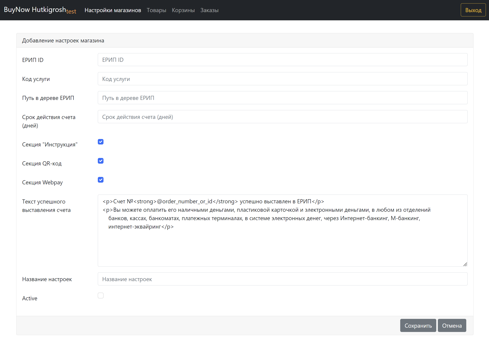

## Описание 
**BuyNow Hutkigrosh** - простая интеграция Вашего сайта с платежной системой ХуткіГрош (ЕРИП)!
* Нет необходимости перехода на CMS системы с модулями электронной коммерции.
* Подходит для создания заказов со страниц социальных сетях

BuyNow позволят самостоятельно сгенерировать уникальную ссылку для оплаты Вашего товара (или группы товаров). Данную ссылку, ввиде кнопки, необходимо просто добавить на сайт (страницу) с описанием товара или услуги.

При нажатии на ссылку клиент будет перенаправлен в корзину с товарами, где закончит оформление заказа и сможет выполнить его оплату. Платежная ссылка также может быть отправлена менеджером клиенту любым удобным способом (по email или в мессенджеры)

## Осноные понятие системы
* **Магазин** - набор настроек, обеспечивающих взаимодействие c Hutkigrosh. Большая часть настроек будет отправлена службой поддержки Hutkigrosh. У одного поставщика услуг, может быть несколько магазинов с разными настройками
* **Товар** - товар или услуга, реализуемая поставщиком
* **Корзина** - группа товаров доступных для оплаты. Администратор самостоятельно создает корзину, добавляя в нее товары. Именно ссылка на корзину будет доступна клиенту. В простейшем случае в корзине будет один товар
* **Заказ** - оформленный клиентом заказ на оплату корзины

## Инструкция по настройке
### Авторизация

</img>

* Адреса:
    * Реальная система https://cmsgate.esas.by/cmsgate-buynow-hutkigrosh/
    * Тестовая система https://cmsgate-test.esas.by/cmsgate-buynow-hutkigrosh/
* Зайдите в административную часть платформы (admin/login), используя авторизационные данные, полученные от службы поддержки ХуткіГрош

### Просмотр список магазинов
* Перейдите в меню [Настройки магазинов] (admin/shop_configs)

</img>

### Создание магазина
* Перейдите в меню [Настройки магазинов] (admin/shop_configs) и добавьте новый магазин. 

</img>

* Укажите необходимые настройки:
    * ЕРИП ID - Уникальный идентификатор услуги ЕРИП
    * Код услуги – код услуги у поставщика услуг в системе ЕРИП (один ПУ может предоставлять несколько разных услуг)
    * Путь в дереве ЕРИП - путь для оплаты счета в дереве ЕРИП, который будет показан клиенту после оформления заказа (например, Платежи > Магазин > Заказы)
    * Срок действия счета - как долго счет, будет доступен в ЕРИП для оплаты
    * Секция "Инструкция" - если включена, то на итоговом экране клиенту будет доступна пошаговая инструкция по оплате счета в ЕРИП
    * Секция QR-code - если включена, то на итоговом экране клиенту будет доступна оплата счета по QR-коду
    * Секция Webpay - если включена, то на итоговом экране клиенту отобразится кнопка для оплаты счета картой (переход на Webpay)
    * Текст успешного выставления счета - текст, отображаемый кленту после успешного выставления счета. Может содержать html. В тексте допустимо ссылаться на переменные @order_id, @order_number, @order_total, @order_currency, @order_fullname, @order_phone, @order_address
    * Название настроек – название отображаемое в административной части системы. Используется при привязке корзины товаров к магазину
    * Активность – только корзины привязанные к активному магазину доступны клиентам для оформления заказа

### Список товаров
* Перейдите в меню [Товары] (admin/products)

</img>

### Создание товара
* Перейдите в меню [Товары] (admin/products) и добавьте новый товар

</img>

* Укажите необходимые параметры:
    * SKU – Ваш внутренний артикул товара
    * Name – кратое название товара/услуги
    * Image – url на картинку с товаром. Будет отображаться клиенту при оформлении заказа
    * Description – полное описание товара
    * Active – активность товара. Только активные товары будут отображаться клиентам при оформлении заказа

### Список корзин
* Перейдите в меню [Корзины] (admin/ baskets)

</img>

### Создание корзины
* Перейдите в меню [Корзины] (admin/ baskets) и добавьте новый корзину

</img>

* Укажите необходимые параметры:
    * Name – краткое название корзины товаров
    * Description – подробное описание группы товаров. Будет отображаться клиентам при оформлении заказа
    * Shop config – привязка к созданным ранее настройкам магазина
    * Active – активность корзины
    * Лимит оплат - как много заказов можно оформить для корзины. 0 - без ограничений. Задаётся для товаров, по которым ограничено доступное количество
    * Срок действия - заказать товары в корзине можно будет только не позднее указанной даты
    * Ask name? – необходимо ли запрашивать ФИО клиента при оформлении заказа
    * Ask email? – необходимо ли запрашивать email клиента при оформлении заказа
    * Ask phone? – необходимо ли запрашивать номер телефона клиента при оформлении заказа
    * Return url – адрес Вашего сайта на который клиент сможет перейти в процессе или после оформления заказа
    * UI css url – ссылка на внешний css для кастомизации внешнего вида корзины
    
* После добавления новой корзины необходимо перейти к ее редактированию

</img>

* В верхней части страницы появится панель с уникальной ссылкой для клиента. Именно эту ссылку необходимо использовать на своем сайте/страницы для перенаправления клиента на офрмление заказа. 
* В нижней части стрианцы появится таблица для добавления товаров в корзину.

</img>

* При добавлении товара необходимо указать 
        * Initial Count – начальное количество товаров в корзине
        * Max Count – максимальное количество товаров в корзине, которое может задать клиент при оформлении заказа
        
### Список заказов
* Перейдите в меню [Закзаы] (admin/orders) и просмотрите актуальный список заказов, созданных Вашими клиентами, через систему BuyNow Hutkigrosh. После оплаты заказа в системе Hutkigrosh его статус изменится, автоматически.

</img>

### Просмотр детелай заказа
* При переходе в детали заказа в верхней части страницы отображается уникальная ссылка для оплаты именно этого заказа. В случае создания заказа менеджеров в ручном режиме эта ссылка может быть отправлена клиенту любым удобным способом

</img>

        
    
    

